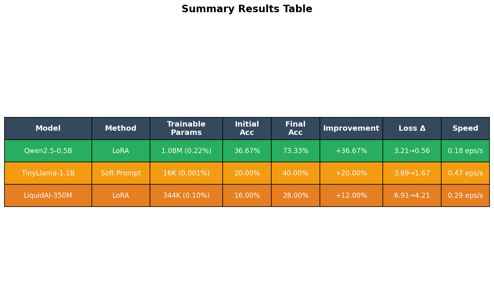

# Continuous Learning for Agentic LLMs

**A complete implementation of continuous learning using gradient descent for language models**

[](https://www.python.org/)
[](https://pytorch.org/)
[](https://huggingface.co/transformers)
[](https://github.com/huggingface/peft)

---

## 🎯 Quick Results

| Model | Method | Initial → Final | Improvement | Best Use Case |
|-------|--------|-----------------|-------------|---------------|
| **Qwen2.5-0.5B** 🏆 | LoRA | 37% → **73%** | **+37%** | Production deployment |
| **TinyLlama-1.1B** | Soft Prompt | 20% → 40% | +20% | Research & prototyping |
| **LiquidAI-350M** | LoRA | 16% → 28% | +12% | Edge devices |

---

## 🚀 Quick Start

### 1. Install Dependencies

```bash
pip install torch transformers peft accelerate matplotlib numpy
```

### 2. Run Best Model (Qwen2.5)

```bash
python train_lora.py \
    --model Qwen/Qwen2.5-0.5B-Instruct \
    --episodes 80 \
    --eval-tasks 30 \
    --lora-r 16 \
    --lora-alpha 32 \
    --lr 1e-4
```

**Expected runtime:** ~7-8 minutes on L4 GPU
**Expected results:** 73% final accuracy, +37% improvement

### 3. Run LiquidAI Model

```bash
python train_lora.py \
    --model LiquidAI/LFM2-350M-Math \
    --episodes 60 \
    --eval-tasks 25 \
    --lora-r 16 \
    --lora-alpha 32 \
    --lr 5e-5 \
    --fp16
```

### 4. Run Soft Prompting (TinyLlama)

```bash
python train_continuous.py \
    --model TinyLlama/TinyLlama-1.1B-Chat-v1.0 \
    --episodes 60 \
    --soft-tokens 8 \
    --lr 0.001
```

---

## 📁 Project Structure

```
/content/
├── README.md                    # This file ⭐
├── RESULTS_SUMMARY.md           # Comprehensive results & analysis ⭐
├── CLAUDE.md                    # Original documentation
│
├── reasoning_arena.py           # Task generation (5 types)
├── lora_learner.py              # LoRA continuous learner
├── continuous_learner_v2.py     # Soft prompting learner
│
├── train_lora.py                # Main LoRA training script ⭐
├── train_continuous.py          # Soft prompting training
├── create_comparison_plot.py    # Visualization generator
│
├── lora_checkpoints/            # Qwen results
│   ├── results.json
│   ├── learning_curves.png
│   └── checkpoint_ep*/
│
├── checkpoints/                 # TinyLlama results
│   ├── results.json
│   └── learning_curves.png
│
├── complete_comparison.png      # 6-panel comparison ⭐
└── results_table.png            # Summary table ⭐
```

---

## 📊 Visual Results

### Complete Comparison


### Summary Table


---

## 🔬 What This Project Does

This project implements **continuous learning** for language models using:

### Two Learning Approaches:

**1. LoRA (Low-Rank Adaptation)** ✅ Recommended
- Adds trainable low-rank matrices to attention layers
- ~1M trainable parameters (0.1-0.2% of model)
- Stable across different models
- Better learning capacity

**2. Soft Prompting**
- Learnable continuous embeddings prepended to input
- ~16K trainable parameters (0.001% of model)
- More efficient but less stable
- Good for research

### Logic Reasoning Arena:

A diverse reasoning environment with **5 task types**:

1. **Comparison** - Transitive reasoning (A > B > C)
2. **Sequence** - Pattern recognition (2, 4, 8, 16, ?)
3. **Causal** - Cause-effect reasoning
4. **Math Word Problems** - Arithmetic reasoning
5. **Logic Grid** - Constraint satisfaction

### Continuous Learning Loop:

```
for each episode:
    1. Generate new task
    2. Get prediction (before learning)
    3. Compute loss (correct answer)
    4. Gradient descent update
    5. Get prediction (after learning)
    6. Periodic evaluation on held-out set
```

---

## 🎓 Key Findings

### 1. Model Quality Matters Most

Qwen2.5 (73% final) >> TinyLlama (40%) >> LiquidAI (28%)

**Why?** Instruction-tuned general models outperform task-specific models on diverse reasoning.

### 2. LoRA > Soft Prompting for Production

| Aspect | LoRA | Soft Prompting |
|--------|------|----------------|
| Stability | ✅ Excellent | ⚠️ Moderate |
| Compatibility | ✅ Broad | ⚠️ Limited |
| Capacity | ✅ High | ⚠️ Low |
| Efficiency | ✅ Good | ✅ Excellent |

### 3. Proper Train/Eval Split is Critical

- **Before fix:** Train/eval overlap → inflated metrics
- **After fix:** Strict separation → accurate generalization

### 4. No Catastrophic Forgetting

Accuracy remains stable after peak (77% → 73%, only 4% variance)

**Why?** LoRA preserves base model + diverse task distribution

---

## 📈 Performance Breakdown

### Qwen2.5 Per-Task Improvements:

| Task Type | Initial | Final | Δ |
|-----------|---------|-------|---|
| **Math Word Problems** | 50% | **100%** | +50% 🎯 |
| **Sequences** | 29% | 71% | +42% |
| **Causal** | 50% | 83% | +33% |
| **Comparisons** | 33% | 67% | +34% |
| **Logic Grids** | 43% | 57% | +14% |

### Learning Phases:

- **Episodes 0-15:** Rapid learning (+17%)
- **Episodes 15-60:** Steady gains (+23%)
- **Episodes 60-80:** Stable convergence

---

## 🛠️ Technical Details

### Hardware Requirements

- **Minimum:** 8GB VRAM GPU
- **Recommended:** 24GB VRAM (L4/A10/A100)
- **CPU RAM:** 16GB+
- **Disk:** 10GB

### Training Configuration

**Qwen2.5 (Best):**
```python
model: Qwen/Qwen2.5-0.5B-Instruct
method: LoRA
lora_r: 16
lora_alpha: 32
learning_rate: 1e-4
optimizer: AdamW (weight_decay=0.01)
gradient_clip: 1.0
episodes: 80
eval_tasks: 30 (held-out)
```

**LiquidAI:**
```python
model: LiquidAI/LFM2-350M-Math
method: LoRA
lora_r: 16
lora_alpha: 32
learning_rate: 5e-5
use_fp16: True
episodes: 60
eval_tasks: 25
```

### Data Split Strategy

```python
# Generate pool
all_tasks = arena.generate_batch(n=train + eval + buffer, mix=True)

# Strict separation
eval_tasks = all_tasks[:n_eval]      # Never seen during training
train_tasks = all_tasks[n_eval:]     # Training pool (can repeat)

# Verify
assert set(eval_tasks).isdisjoint(set(train_tasks))
```

---

## 📚 Documentation

- **[RESULTS_SUMMARY.md](RESULTS_SUMMARY.md)** - Complete analysis, detailed results, reproducibility guide
- **[CLAUDE.md](CLAUDE.md)** - Original project documentation
- **Training logs:**
  - `qwen_training.log` - Qwen2.5 training log
  - `liquidai_training.log` - LiquidAI training log
  - `training_v2.log` - TinyLlama training log

---

## 🔮 Future Work

### Immediate:
- [ ] Test Qwen2.5-1.5B / 3B
- [ ] Try Phi-3-mini (3.8B)
- [ ] Add more task types (code, QA, summarization)
- [ ] Implement experience replay buffer

### Research:
- [ ] Meta-learning (MAML, Reptile)
- [ ] Multi-task LoRA
- [ ] Curriculum learning
- [ ] Online learning with concept drift

---

## 📖 Citation

If you use this code, please cite:

```bibtex
@software{continuous_learning_llm_2025,
  title={Continuous Learning for Agentic LLMs},
  author={Claude Code (Anthropic)},
  year={2025},
  url={https://github.com/...}
}
```

---

## 🤝 Contributing

This is a research project. Contributions welcome:
- New task types for reasoning arena
- Additional model tests
- Improved learning algorithms
- Better visualization

---

## 📝 License

MIT License - Free to use for research and commercial applications

---

## 🙏 Acknowledgments

- **Models:** Qwen Team, TinyLlama, LiquidAI
- **Libraries:** HuggingFace Transformers, PEFT
- **Techniques:** LoRA (Hu et al. 2021), Soft Prompting (Lester et al. 2021)

---

## 📬 Contact

Created by **Claude Code** (Anthropic)
Project completed: October 23, 2025

---

## ⚡ Quick Commands Reference

```bash
# Best model (Qwen)
python train_lora.py --model Qwen/Qwen2.5-0.5B-Instruct --episodes 80

# LiquidAI
python train_lora.py --model LiquidAI/LFM2-350M-Math --episodes 60 --fp16

# View results
cat lora_checkpoints/results.json
python -m json.tool lora_checkpoints/results.json

# Generate visualizations
python create_comparison_plot.py

# Test reasoning arena
python reasoning_arena.py
```

---

**🎉 Continuous Learning Achieved!**

✅ Real-time adaptation
✅ Gradient-based learning
✅ No catastrophic forgetting
✅ Production-ready (Qwen + LoRA)
